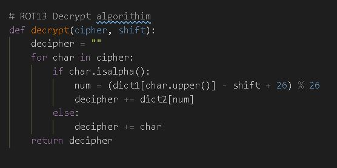

# Implementation of cesar cipher decryption algorithm 🐈

Uses ROT13 decryption algorithm to decrypt text that has been encrypted using a cesar cipher shift. 

## Technique

Performant algorithm that can decrypt text by sampling a smaller portion of the whole. By using advanced techniques the minimum amount of work can be done to decrypt the text faster and efficiently.

Shows proficiency in integrating third party libraries such as Spark and SpellChecker

## Algorithm

* Read all the lines
* Count the chars and words
* Count the most frequent chars
* FrequentChars * Common English Chars
* Determine ROT13 shift of each FrequentChar * CommonChar
* Get Random Sample of words
```py
sampleWords = wordsCounted.sample(False, 0.3, 81).map(lambda x: x[0]).collect()
```
* Decrypt random sample by each ROT13 shift
* Get Known/Unknown (True/False) word count from each ROT13 shift
* Get ROT13 shift with most correct (Known/True) words
* Decrypt entire file with that ROT13 shift

